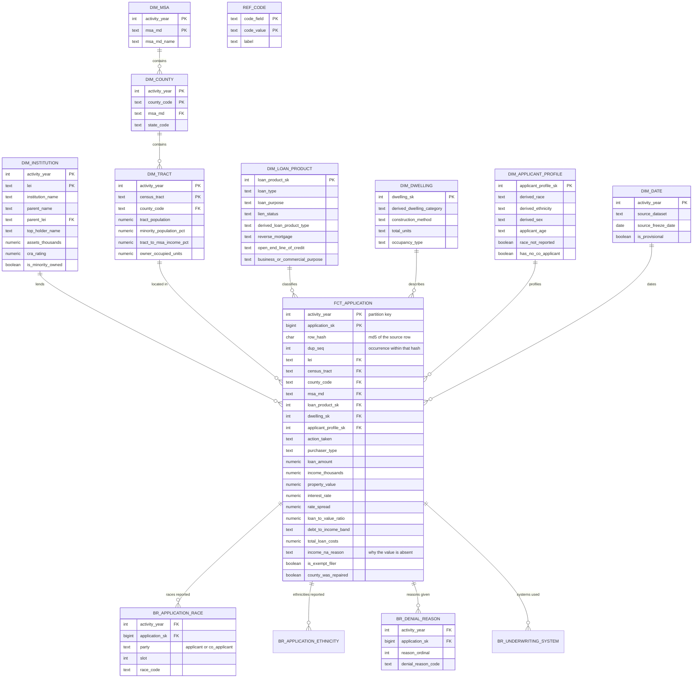

# Phase 04: Designing the data model

How one flat file of 99 columns became 15 tables, what evidence forced each decision, and how to verify every claim on this page.

Previous phase: [03 Landing the raw layer](03_landing_the_raw_layer.md) · Next phase: [05 Building the objects](05_building_the_objects.md)

---

## 1. Why the raw layer was built before this document

The usual order for a database you are designing is model first, build second. This project inverts the first two steps, deliberately, and the reason matters more than the model.

HMDA data arrives in a shape nobody here chose. The design question is therefore not "what should this look like" but "what is actually in it", and that cannot be answered from a field specification. So the raw layer was landed exactly as published, everything as text, no casting and no opinions, and only then was the model designed against measurements.

That order changed three decisions. Designing from the published field list alone would have produced a plausible model that was wrong in all three places.

| Decision | What the specification suggests | What the data showed | Measured |
|---|---|---|---|
| Tract dimension grain | one row per census tract | **5,064 of 5,282 tracts** carry different census attributes in different filing years | tract must be grained by year |
| Race and ethnicity | use the pre-derived summary column | the summary hides multi-race applicants: it reports **3,870** where the underlying fields hold **18,051** | bridge tables are required, not optional |
| Primary key | use the loan identifier | there is none, and **2,081 groups of byte-identical rows** exist (2,776 excess rows) | a deterministic surrogate is unavoidable |

Every figure on this page is reproducible. The query that produced it is shown beside it.

---

## 2. The four rules

Each of the 99 columns was tested against these in order. The first rule that matched decided its destination. No column was placed by preference.

**Rule 1. Is it a repeating group?**
A column whose name ends in a number, where the same fact recurs across numbered slots, violates first normal form. The slot number is a spreadsheet artefact, not information. These become **bridge tables**, one row per reported value.

**Rule 2. Does it describe something other than this application?**
Group by the candidate key and count distinct values of the column. If the answer is always one, the column depends on that key rather than on the application, and repeating it on every row is duplication. These become **dimensions**.

**Rule 3. Is it a code standing in for a label?**
A numeric code with a published meaning stays on the fact **as the code**. The meaning lives once, in `ref.ref_code`. Overwriting codes with text destroys the ability to detect a value nobody has mapped.

**Rule 4. Is it a measurement of this application?**
Whatever remains, and varies application by application, is a **measure or degenerate attribute on the fact**.

---

## 3. The evidence, decision by decision

### 3.1 The repeating groups are real, not theoretical

Race, ethnicity, denial reason and automated underwriting system each arrive as numbered columns. If only the first slot were ever used, unpivoting them would be pedantry. Slot usage across all four years:

| group | slot 1 | slot 2 | slot 3 | slot 4 | slot 5 |
|---|---|---|---|---|---|
| applicant race | 1,754,207 | 106,971 | 6,311 | 514 | 142 |
| co-applicant race | 1,754,662 | 37,727 | 2,149 | 117 | 29 |
| denial reason | 347,991 | 75,535 | 13,492 | 1,573 | n/a |
| underwriting system | 868,575 | 148,643 | 45,053 | 7,032 | 6,231 |

106,971 applicants report a second race. 75,535 denials cite a second reason. 148,643 applications ran through a second underwriting system. Those are facts held in column positions, and the only way to count them correctly is to give each one a row.

```sql
-- reproduce the table above
SELECT party, slot, count(*)
FROM marts.br_application_race
GROUP BY 1, 2 ORDER BY 1, 2;
```

### 3.2 The flat race field hides four fifths of multi-race applicants

`derived_race` is the CFPB's own summary column, and it is the obvious thing to use. It places **3,870** applications in its "2 or more minority races" bucket. Counting from the underlying fields instead gives **18,051**, which is 4.7 times as many.

The difference is applicants who reported White alongside a minority race. The summary field classifies them elsewhere, so they vanish from any multi-race count built on it.

```sql
-- the correct count: roll subcategories up to their top-level parent first
WITH toplevel AS (
  SELECT activity_year, application_sk,
         CASE WHEN race_code IN ('2','21','22','23','24','25','26','27') THEN '2'
              WHEN race_code IN ('4','41','42','43','44')                THEN '4'
              ELSE race_code END AS race_top
  FROM marts.br_application_race
  WHERE party = 'applicant' AND race_code NOT IN ('6','7')
), d AS (SELECT DISTINCT * FROM toplevel)
SELECT count(*) FROM (
  SELECT activity_year, application_sk FROM d GROUP BY 1, 2 HAVING count(*) > 1
) multi;
```

**A trap to avoid.** HMDA race codes are hierarchical. An applicant may report `2` (Asian) and `22` (Chinese), which is one race stated at two levels of detail, not two races. A naive "more than one race code" test returns about 94,000 applications and is simply wrong. The `CASE` above rolls subcategories up to their parent before counting, which is why the answer is 18,051 and not 94,000.

### 3.3 Geography and institution attributes move between years

Seven census columns are carried on every application row, but they describe a neighbourhood. The test for whether they belong elsewhere is whether they vary within their key.

```sql
-- 5,064 of 5,282 tracts have different attributes in different years
SELECT count(*) FROM (
  SELECT census_tract FROM marts.dim_tract WHERE census_tract <> 'UNKNOWN'
  GROUP BY 1
  HAVING count(DISTINCT coalesce(tract_population, -1)
                     || '|' || coalesce(minority_population_pct, -1)
                     || '|' || coalesce(tract_to_msa_income_pct, -1)) > 1
) z;

-- but zero tract-years have conflicting attributes, so (tract, year) is a valid grain
SELECT count(*) FROM (
  SELECT activity_year, census_tract FROM marts.dim_tract
  GROUP BY 1, 2 HAVING count(*) > 1
) z;
```

The first returns 5,064. The second returns 0. Together they say: one row per tract is wrong, one row per tract per year is right.

The same applies to lenders. **2,367 institutions change their name or their parent organisation across the four years**, so `dim_institution` is grained by year too.

### 3.4 There is no natural key, and an identity column would break reproducibility

The Bureau strips every loan identifier before publication. That is intentional, and it leaves the register with no candidate key at all: **2,081 groups of byte-identical rows exist, totalling 2,776 excess rows**.

A `GENERATED ALWAYS AS IDENTITY` column would solve uniqueness and create a worse problem: different keys on every rebuild, so nobody cloning this repository could reconcile against the figures published here.

The key used instead is deterministic:

```sql
md5(source_row::text)          AS row_hash,
row_number() OVER (PARTITION BY md5(source_row::text)
                   ORDER BY lei, census_tract) AS dup_seq
```

`(row_hash, dup_seq)` is unique, stable across rebuilds, and traceable to the source row. Identical rows receive sequential occurrence numbers, which is the honest answer: the data cannot distinguish them, so the model does not pretend to. `application_sk` is a compact bigint derived from the same ordering, kept for join performance, and a `UNIQUE` constraint on `(activity_year, row_hash, dup_seq)` enforces the claim.

This reproducibility was verified: the database was built independently on two machines from the published files and produced identical figures to one decimal place.

---

## 4. The model

Three schemas. `raw` holds the files as received and is never edited. `ref` holds reference data and metadata. `marts` holds the model.

| object | kind | grain | rows |
|---|---|---|---|
| `marts.fct_application` | fact, partitioned by `activity_year` | one application | 1,754,846 |
| `marts.br_application_race` | bridge | application, party, slot | 3,662,829 |
| `marts.br_application_ethnicity` | bridge | application, party, slot | 3,597,440 |
| `marts.br_underwriting_system` | bridge | application, slot | 1,075,534 |
| `marts.br_denial_reason` | bridge | application, slot | 438,591 |
| `marts.dim_tract` | dimension | census tract per year | 20,820 |
| `marts.dim_institution` | dimension | lender per year | 19,321 |
| `marts.dim_applicant_profile` | junk dimension | demographic combination | 4,745 |
| `marts.dim_msa` | dimension | metro area per year | 1,666 |
| `marts.dim_county` | dimension | county per year | 255 |
| `marts.dim_loan_product` | junk dimension | product combination | 194 |
| `marts.dim_dwelling` | junk dimension | property combination | 41 |
| `marts.dim_date` | dimension | filing year, with publication vintage | 4 |
| `marts.quarantine_application` | exception table | rows failing a domain rule | 573 |
| `ref.ref_code` | reference | code field, code value | 450 |

Enforced by 62 foreign keys, 25 check constraints, 17 primary keys and 5 unique constraints.

### Why three junk dimensions

`dim_loan_product` collapses seven coded columns into **194** real combinations across 1.75 million rows. `dim_dwelling` collapses four into **41**. Storing the combination once and pointing at it beats repeating eleven codes on every row, and it gives the combinations names.

### Diagram



The diagram is not decorative. Every relationship shown exists as a declared foreign key and can be listed from the catalogue:

```sql
SELECT c.conname, t.relname AS child, rt.relname AS parent
FROM pg_constraint c
JOIN pg_class t ON t.oid = c.conrelid
JOIN pg_class rt ON rt.oid = c.confrelid
JOIN pg_namespace n ON n.oid = t.relnamespace
WHERE c.contype = 'f' AND n.nspname = 'marts'
ORDER BY 2, 1;
```

---

## 5. Where all 99 columns went

### Bridged, 24 columns

| source | destination |
|---|---|
| `applicant_race-1` … `-5`, `co-applicant_race-1` … `-5` | `br_application_race` |
| `applicant_ethnicity-1` … `-5`, `co-applicant_ethnicity-1` … `-5` | `br_application_ethnicity` |
| `denial_reason-1` … `-4` | `br_denial_reason`, code 10 "not applicable" dropped |
| `aus-1` … `-5` | `br_underwriting_system`, code 6 "not applicable" dropped |

### Dimensioned, 31 columns

| source | destination |
|---|---|
| `tract_population`, `tract_minority_population_percent`, `ffiec_msa_md_median_family_income`, `tract_to_msa_income_percentage`, `tract_owner_occupied_units`, `tract_one_to_four_family_homes`, `tract_median_age_of_housing_units` | `dim_tract` |
| `county_code`, `state_code` | `dim_county` |
| `derived_msa-md` | `dim_msa` |
| `lei` | `dim_institution`, enriched from the transmittal sheet and the Philadelphia Fed lender file |
| `loan_type`, `loan_purpose`, `lien_status`, `derived_loan_product_type`, `reverse_mortgage`, `open-end_line_of_credit`, `business_or_commercial_purpose` | `dim_loan_product` |
| `derived_dwelling_category`, `construction_method`, `total_units`, `occupancy_type` | `dim_dwelling` |
| `derived_race`, `derived_ethnicity`, `derived_sex`, `applicant_age`, `co-applicant_age` | `dim_applicant_profile` |
| `activity_year` | `dim_date`, also the partition key |
| plus `census_tract` as the tract dimension's key | `dim_tract` |

### On the fact, 33 columns

**Keys and outcome:** `activity_year`, `lei`, `census_tract`, `county_code`, `derived_msa-md`, `action_taken`, `purchaser_type`, `preapproval`

**Measures cast to numeric:** `loan_amount`, `income`, `property_value`, `interest_rate`, `rate_spread`, `loan_to_value_ratio`, `total_loan_costs`, `total_points_and_fees`, `origination_charges`, `discount_points`, `lender_credits`, `loan_term`, `intro_rate_period`, `multifamily_affordable_units`

**Kept as text:** `debt_to_income_ratio`, because the source publishes bands such as `20%-<30%`, not numbers

**Codes kept as codes:** `conforming_loan_limit`, `hoepa_status`, `applicant_credit_score_type`, `co-applicant_credit_score_type`, `submission_of_application`, `initially_payable_to_institution`

### Not carried, 17 columns

Listed by name, because a mapping document that omits its omissions is not a mapping document.

**Superseded, 4.** `applicant_sex`, `co-applicant_sex`, `applicant_age_above_62`, `co-applicant_age_above_62`. The first two duplicate `derived_sex`, which handles joint applications correctly. The age flags are derivable from `applicant_age`.

**Loan feature flags, 7, a genuine gap.** `negative_amortization`, `interest_only_payment`, `balloon_payment`, `other_nonamortizing_features`, `prepayment_penalty_term`, `manufactured_home_secured_property_type`, `manufactured_home_land_property_interest`. These describe non-standard loan structures and belong in `dim_loan_product`. Adding them would raise its row count from 194 to a few hundred, which is still small.

**The observation flags, 6, and these matter.** `applicant_ethnicity_observed`, `co-applicant_ethnicity_observed`, `applicant_race_observed`, `co-applicant_race_observed`, `applicant_sex_observed`, `co-applicant_sex_observed`.

Each records whether the lender captured that characteristic **by visual observation or surname** rather than from the applicant's own report. In a study of disparity in lending outcomes, the difference between what an applicant said about themselves and what a loan officer assumed is not a minor field. These should be on the fact.

---

## 6. Handling absence

HMDA encodes "no value" five different ways in otherwise numeric columns: the literal `NA`, the literal `Exempt`, and the sentinels `1111`, `8888` and `9999`. Collapsing all five to NULL is the only safe cast, but the reason for the NULL is itself information, so it is preserved.

```sql
CREATE FUNCTION ref.to_num(v text) RETURNS numeric ...     -- all five become NULL
CREATE FUNCTION ref.na_reason(v text) RETURNS text ...     -- records which one it was
```

The fact carries `income_na_reason`, `dti_na_reason`, `ltv_na_reason` and `rate_spread_na_reason` beside their measures. A co-applicant age of `9999` means there is no co-applicant, which is not missing data, and an analysis that treats it as missing is wrong.

One repair is applied rather than recorded. The county FIPS code is by construction the first five characters of an 11-digit census tract code, so a missing `county_code` is recoverable whenever the tract is present. 236 rows were repaired this way and are flagged by `county_was_repaired`.

---

## 7. Reconciliation

The column counts above are a description. The row count is a test, and it runs on every build.

```sql
SELECT * FROM marts.assert_results WHERE assertion = 'fact_does_not_reconcile_to_raw';
```

It asserts that `raw.raw_lar` equals `marts.fct_application` plus `marts.quarantine_application`. Currently 1,755,419 = 1,754,846 + 573.

---

## 8. What a reviewer should check

Four claims on this page are worth verifying independently, and every one has a query above it.

1. The grain of `dim_tract` is justified: section 3.3 returns 5,064 and 0.
2. The bridge tables are necessary, not decorative: section 3.2 returns 18,051 against 3,870.
3. The surrogate key is deterministic: rebuild the database and the figures in section 3.4 are unchanged.
4. The diagram matches the database: the catalogue query in section 4 lists every relationship drawn.

If any of those fail, this document is wrong and should be corrected rather than defended.
